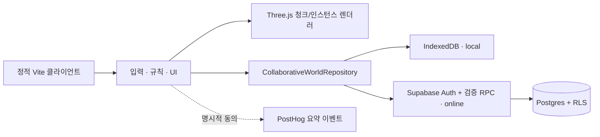

<p align="center">
  
</p>

<h1 align="center">루멘문 <sub>Lumenmoon</sub></h1>

<p align="center">
  떠난 플레이어의 블록이 다음 방문자의 발견이 되는<br />
  <strong>1인칭 비동기 공동 복셀 건축 게임</strong>
</p>

<p align="center">
  <a href="https://lumenmoon.vercel.app/"><strong>웹에서 플레이</strong></a>
  · <a href="docs/game-mvp.md">게임 규칙</a>
  · <a href="docs/supabase-local.md">온라인 개발 환경</a>
  · <a href="docs/analytics.md">제품 분석 원칙</a>
</p>

> [!IMPORTANT]
> 현재 공개 데모는 `local` 모드입니다. 누구나 접속할 수 있지만 월드는 각 브라우저의 IndexedDB에 저장됩니다. 실제 사용자 간 공동 월드는 Supabase Cloud 환경 변수를 연결한 `online` 배포에서 활성화됩니다.

<sub>상단 이미지는 제품 방향을 표현한 콘셉트 아트입니다. 실제 실행 화면은 아래에서 확인할 수 있습니다.</sub>

## 루멘문은 어떤 게임인가요?

동시에 접속한 사람이 없어도 온라인 세계처럼 느껴지는 짧은 건축 경험을 목표로 합니다. 누군가 남긴 블록, 제작자 문양과 공개 ID, 완성된 공동 관문이 다음 플레이어의 실제 플레이 대상이 됩니다.

첫 접속 흐름은 단순합니다.

1. 겹치지 않는 개인 베이에 스폰하고 블록 24개를 받습니다.
2. 개인 공간 16칸과 생산시설 8칸을 가이드에 맞춰 완성합니다.
3. 시운전 보상 2개를 받고 블록 생산을 해금합니다.
4. 남은 블록으로 중앙 공동 미션 `별빛 관문`에 기여합니다.
5. 다음 방문자는 원본과 4방향 대칭 구조, 제작자 카드, 기여자의 빛, 기록관에서 이전 결과를 발견합니다.

### 핵심 경험

- **짧게 만들어도 세계에 남습니다.** 블록에는 고정 공개 ID, 조합형 닉네임, 문양과 설치 시각이 연결됩니다.
- **작은 기여가 크게 보입니다.** 서버에는 원본 24슬롯만 저장하고 클라이언트가 4방향으로 복제해 최대 96블록의 관문으로 표현합니다.
- **경쟁보다 공동 완성을 강조합니다.** 순위표 없이 모든 기여자의 문양을 같은 크기로 보여 줍니다.
- **저트래픽에 맞게 설계했습니다.** Realtime이나 상시 폴링 없이 입장·청크 이동·탭 복귀 때 필요한 범위만 동기화합니다.

## 실제 화면

| 데스크톱 | 모바일 |
| --- | --- |
|  |  |
| Pointer Lock 기반 WASD·마우스 조작 | 이동 스틱·시점 드래그·행동 버튼을 분리한 터치 조작 |

## 조작

| 기능 | 데스크톱 | 모바일 |
| --- | --- | --- |
| 이동·시점 | `WASD` · 마우스 | 왼쪽 스틱 · 오른쪽 드래그 |
| 점프 | `Space` | 점프 버튼 |
| 배치·제거 | 좌클릭 · 우클릭/홀드 | 배치 · 제거/홀드 버튼 |
| 블록 종류 | `1` 큐브 · `2` 계단 · `3` 조명 | 하단 블록 아이콘 |
| 색상·회전 | `Q`/`E` · `R` | 팔레트 · 회전 버튼 |
| 수동 생산·초기화 | `F` · `X` | 상태 패널의 행동 버튼 |
| 상세 패널 | `I` 인벤토리 · `M` 공동 미션 | 상태·미션의 `⌄` 버튼 |
| 메뉴 조작 | `Esc`로 Pointer Lock 해제 | 화면 버튼·시트 |

기본 HUD는 블록 아이콘·보유 수량과 핵심 진행만 표시합니다. 세부 생산 상태, 단축키, 미션 참여 기능은 필요할 때만 펼칩니다. 공동 미션은 기여가 늘 때마다 `5%` 단위로 발광이 성장하고, `25%·50%·75%·100%`에는 구조 연출도 함께 바뀝니다.

모바일은 가로 화면을 우선하며, 세로 화면에서는 핵심 조작과 패널이 조준점을 침범하지 않도록 축약 배치합니다. 설치형 웹 앱은 manifest에서 가로 방향을 우선 요청합니다. 게임 화면 자체는 스크롤되지 않으며, 기록관처럼 내용이 긴 별도 화면만 내부 스크롤을 사용합니다.

## 기술 구조



- Vite + TypeScript + Three.js, React 없음
- `16×16×16` 청크와 보이는 큐브 면만 생성하는 메시
- 계단·조명·대칭 복제는 `InstancedMesh`로 묶어 draw call을 제한
- 모바일 DPR `1.25` 상한, 실시간 그림자·Bloom 비활성화
- Supabase 익명 인증, Postgres, RLS, 트랜잭션 RPC
- PostHog는 동의 후 4종의 allowlist 이벤트만 전송

## 빠른 시작

Node.js 22 이상과 npm을 권장합니다.

```powershell
npm install
Copy-Item .env.example .env.local
npm run dev
```

기본 `.env.example`은 외부 서비스에 연결하지 않는 `local` 모드입니다.

```dotenv
VITE_REPOSITORY_MODE=local
VITE_ANALYTICS_ENABLED=false
VITE_PERF_HUD=false
```

### 온라인 공동 월드

Docker Desktop으로 로컬 Supabase를 실행하고 migration·seed를 적용합니다.

```powershell
npm run db:start
npm run db:reset
npm run test:db
```

그다음 `.env.local`을 온라인 모드로 바꿉니다.

```dotenv
VITE_REPOSITORY_MODE=online
VITE_SUPABASE_URL=https://<project>.supabase.co
VITE_SUPABASE_ANON_KEY=<publishable 또는 anon 키>
VITE_SUPABASE_WORLD_ID=00000000-0000-4000-8000-000000000001
```

`VITE_` 변수는 브라우저 번들에서 볼 수 있습니다. publishable/anon 키만 사용하고 service-role·secret·인증 토큰은 절대 넣지 마세요. 설정 오류가 나도 별도의 로컬 월드로 조용히 전환하지 않습니다.

자세한 로컬 URL·익명 인증·HTTP 통합 테스트 절차는 [Supabase 개발 문서](docs/supabase-local.md)를 따릅니다.

## 검증과 빌드

```powershell
npm run lint
npm run typecheck
npm test
npm run build
```

온라인 DB까지 검증할 때는 다음 명령을 추가합니다.

```powershell
npm run db:reset
npm run test:db
npm run test:db:client
npm run test:e2e:online
```

프로덕션 정적 파일은 `dist/`에 생성됩니다. 현재 데모는 [Vercel](https://lumenmoon.vercel.app/)에서 제공하며 GitHub 저장소는 private 상태를 유지할 수 있습니다.

GitHub Actions의 Vercel 자동 배포는 저장소 변수 `ENABLE_VERCEL_DEPLOY=true`와 `VERCEL_TOKEN`, `VERCEL_SCOPE`, `VERCEL_ORG_ID`, `VERCEL_PROJECT_ID` secret을 모두 설정한 경우에만 실행됩니다. 값이 없으면 CI 검증만 수행하고 배포 job은 안전하게 건너뜁니다.

## 비용과 보안 경계

- 별도 Node 서버, Edge Function, WebSocket, Realtime, 크론과 상시 폴링을 사용하지 않습니다.
- 자동 생산은 마지막 서버 정산 시각과 DB `now()`로 계산합니다.
- 주변 청크는 가로 반경 2·수직 반경 1만 읽고 8,192블록 초과 응답은 부분 성공 없이 거절합니다.
- 배치 요청은 최대 24작업·32KiB이며 좌표, 종류, 색상, 회전, 권한, 재고와 support 관계를 서버에서 다시 검증합니다.
- 재고·생산·철거·미션 기여는 mutation 테이블 직접 쓰기가 아닌 멱등 RPC만 사용합니다.
- 제품 분석은 동의 후 세션당 최대 20건, 이벤트당 최대 4KiB의 집계값만 전송합니다.
- 내부 auth UID, 토큰, IP, 정확한 좌표와 자유 텍스트는 공개 제작자 정보나 분석 속성에 포함하지 않습니다.

Supabase와 PostHog 무료 플랜의 한도·비활성 프로젝트 중지 정책은 바뀔 수 있습니다. 운영 전 공급자 대시보드에서 최신 한도와 알림을 확인해야 합니다.

## 저장소 안내

```text
src/
├─ app/          게임 흐름과 온라인 실패 복구
├─ analytics/    동의 기반 저비용 제품 분석
├─ data/         Local/Supabase 저장소 계약
├─ domain/       베이·생산·권한·공동 미션 규칙
├─ input/        데스크톱·멀티터치 입력
├─ rendering/    청크·인스턴스·미션 렌더링
└─ ui/           DOM HUD·기록관·접근성 UI
supabase/        migration, seed, pgTAP
e2e/             데스크톱·대표 모바일·온라인 A/B 흐름
docs/            게임 계약, 분석, 로컬 Supabase 문서
```

## 알려진 MVP 제한

- 익명 계정은 브라우저 저장소를 삭제하거나 기기를 바꾸면 복구할 수 없습니다.
- Realtime이 없어 타인의 새 변경은 청크 재진입 또는 탭 복귀 때 확인합니다.
- 완료 기록은 DB에 남지만 기록관 UI는 최근 50개까지만 보여 줍니다.
- 블록·멱등 작업의 장기 압축과 보관 만료 정책은 아직 없습니다.
- 실제 기종별 장시간 FPS와 8,192블록에 가까운 밀집 월드는 추가 현장 측정이 필요합니다.
- 전투, NPC, 채팅, 실시간 플레이어, 거래, 랭킹과 결제는 MVP 범위 밖입니다.

---

키 아트는 루멘문의 시각 방향을 설명하기 위해 생성한 콘셉트 이미지이며 실제 플레이 캡처가 아닙니다.
