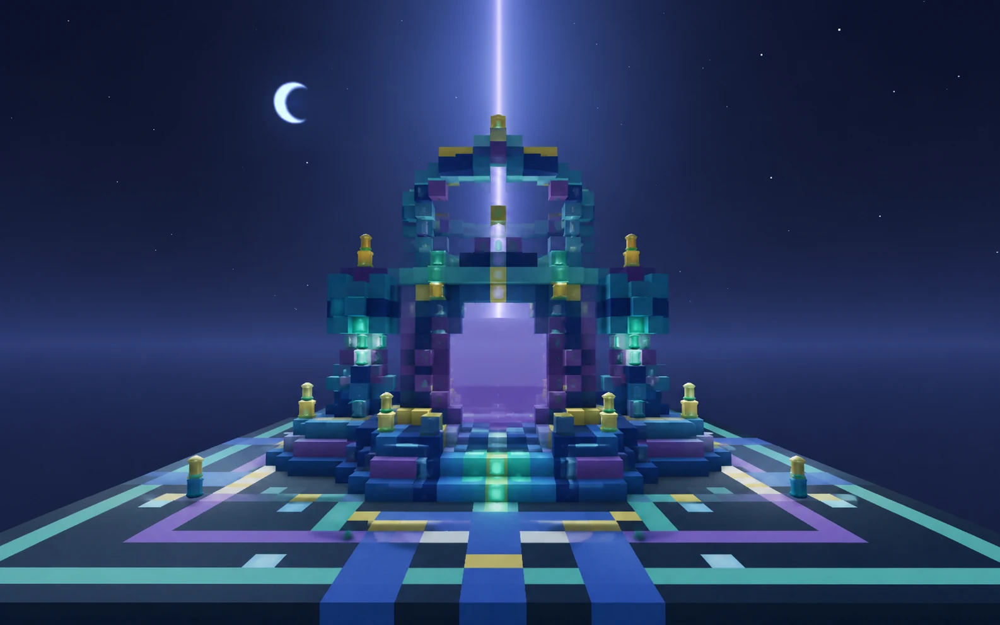
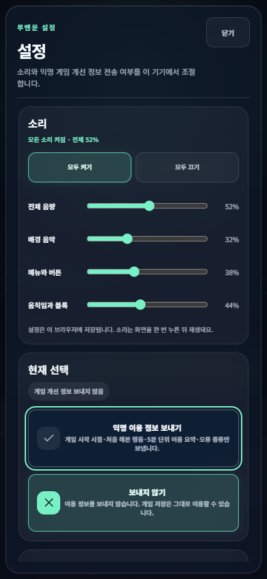
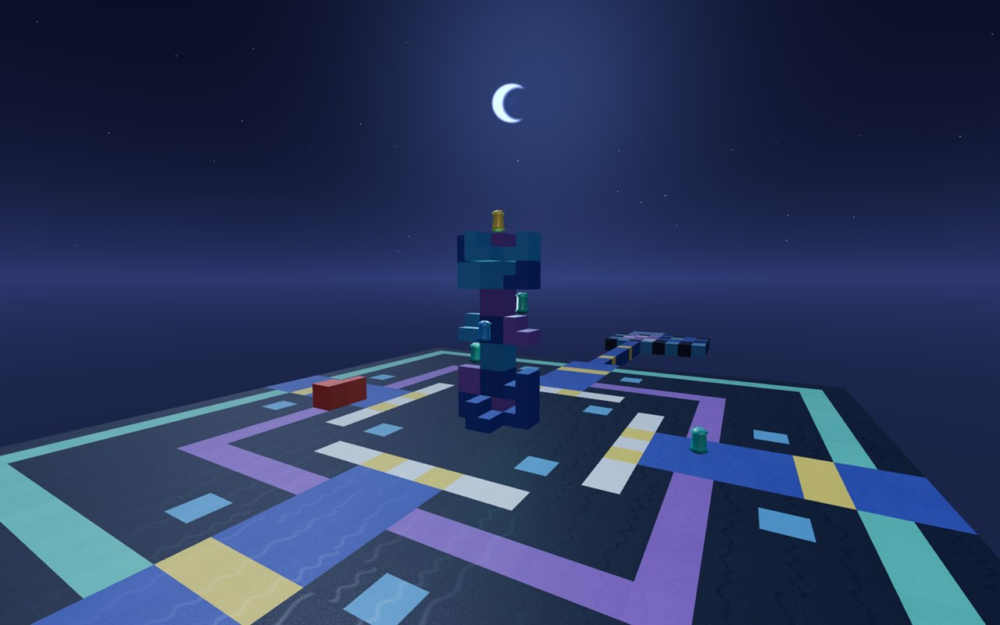
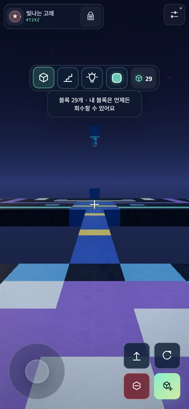
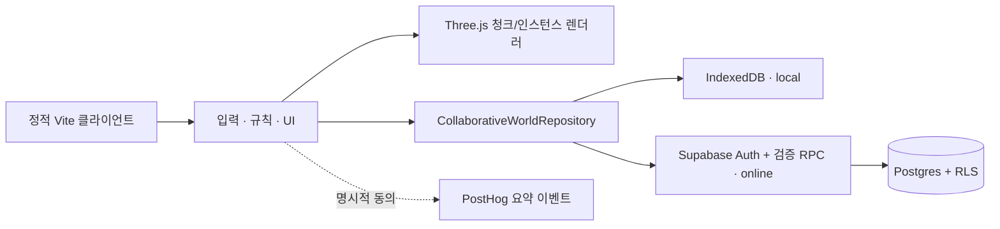

<p align="center">
  
</p>

<h1 align="center">루멘문 <sub>Lumenmoon</sub></h1>

<p align="center">
  누군가 놓은 블록을 발견하고 이어 짓는<br />
  <strong>1인칭 복셀 건축 게임</strong>
</p>

<p align="center">
  <a href="https://lumenmoon.vercel.app/"><strong>웹에서 플레이</strong></a>
  · <a href="docs/game-mvp.md">게임 설계</a>
  · <a href="docs/supabase-local.md">온라인 개발</a>
  · <a href="docs/analytics.md">개인정보와 통계</a>
</p>

> [!IMPORTANT]
> 현재 공개 데모의 건축 내용은 이 브라우저에만 저장됩니다. 여러 사람이 같은 세계를 보는 온라인 연결은 아직 공개 데모에 적용되지 않았습니다.

<sub>상단 이미지는 게임의 블록·색·광원 규칙을 바탕으로 제작한 `별빛 관문` 100% 완성 콘셉트 이미지입니다. 실제 실행 화면은 아래에서 확인할 수 있습니다.</sub>

## 루멘문은 어떤 게임인가요?

루멘문에서는 잠깐 머물다 가도 내가 놓은 블록이 세계에 남습니다. 다른 사람이 남긴 블록을 발견하고, 만든 사람의 이름과 문양을 확인하며, 함께 별빛 관문을 쌓을 수 있습니다.

시작할 때 두 가지 방식을 고를 수 있습니다.

- **자유 건축**: 블록 30개로 바로 시작합니다. 내 블록은 언제든 회수할 수 있고, 다른 사람이 놓은 블록은 3일 뒤부터 정리할 수 있습니다. 한 시간마다 5개가 채워지며 최대 100개까지 보관합니다.
- **별빛 관문**: 내 공간과 블록 공방을 완성한 뒤, 다른 사람들과 중앙 관문을 한 칸씩 이어 짓습니다.

메뉴·자유 건축·별빛 관문에는 서로 다른 잔잔한 배경 음악이 흐르고, 버튼·발걸음·점프·블록 놓기·회수에는 짧은 효과음이 반응합니다. 외부 음원이나 다른 게임의 소리를 복제하지 않고 WebAudio로 직접 만드는 소리라 추가 음원 다운로드가 없습니다. 오른쪽 위 설정에서 전체 소리와 배경 음악·메뉴·게임 효과를 각각 조절할 수 있으며, 선택값은 이 브라우저에 저장됩니다. 브라우저 자동 재생 정책에 따라 첫 화면 입력 뒤부터 소리가 납니다.

<p align="center">
  
</p>

별빛 관문의 첫 흐름도 단순합니다.

1. 겹치지 않는 내 자리에 도착해 블록 24개를 받습니다.
2. 안내선을 따라 내 공간 16칸과 블록 공방 8칸을 채웁니다.
3. 첫 완성 선물 2개를 받고 공방에서 블록을 만들 수 있게 됩니다.
4. 남은 블록 하나를 중앙의 `별빛 관문`에 놓습니다.
5. 다음 방문자는 네 방향으로 펼쳐진 관문, 만든 사람 카드, 함께 만든 사람들, 기록관에서 이전 결과를 발견합니다.

### 핵심 경험

- **짧게 만들어도 세계에 남습니다.** 블록에는 만든 사람의 고유 표식, 이름, 문양과 놓은 시각이 연결됩니다.
- **블록 하나가 관문을 크게 밝힙니다.** 놓은 블록 하나가 네 방향으로 비쳐 최대 96블록 규모의 관문이 됩니다.
- **모두의 문양을 같은 크기로 남깁니다.** 순위표 없이 함께 만든 사람들을 빠짐없이 보여 줍니다.
- **같은 시간에 만나지 않아도 이어집니다.** 다른 사람이 남긴 블록을 발견하고 그다음 작업을 이어 갈 수 있습니다.

### 첫 번째 관문 · 별빛 관문

24곳에 블록이 모두 놓이면 네 방향 대칭 구조가 완성되고, 바닥 문양·좌우 기둥·상단 고리·빛줄기가 차례로 켜집니다. 완성된 관문은 누구도 철거할 수 없고, 다음 층을 이어 지을 수 있습니다.

## 실제 화면

| 데스크톱 | 모바일 |
| --- | --- |
|  |  |
| WASD·마우스 조작 | 이동 스틱·시점 드래그·행동 버튼을 분리한 터치 조작 |

두 이미지는 현재 빌드의 자동화 브라우저 검증에서 저장한 실제 화면입니다. 데스크톱 이미지는 월드 시각 품질을, 모바일 이미지는 자유 건축의 최소 HUD와 조작 배치를 보여 줍니다.

## 조작

| 기능 | 데스크톱 | 모바일 |
| --- | --- | --- |
| 이동·시점 | `WASD` · 마우스, `J`/`L` 좌우·`U`/`K` 상하 시점 | 왼쪽 스틱 · 오른쪽 드래그 |
| 점프 | `Space` | 점프 버튼 |
| 놓기·제거 | 좌클릭 또는 `Enter` · `Delete`/홀드 | 놓기 · 제거/홀드 버튼 |
| 만든 사람 확인 | 블록을 조준하고 우클릭하면 이름·놓은 날짜가 잠시 표시됨 | 조준점 아래 만든 사람 요약의 `더보기` |
| 블록 종류 | `1` 큐브 · `2` 계단 · `3` 조명 | 하단 블록 아이콘 |
| 색상·회전 | `Q`/`E` · `R` | 팔레트 · 회전 버튼 |
| 블록 만들기·다시 짓기 | `F` · `X` (별빛 관문) | 내 정보의 행동 버튼 |
| 상세 화면 | `I` 가방 · `M` 별빛 관문 | 가방·관문 펼치기 버튼 |
| 메뉴 조작 | `Esc`로 시점 고정을 해제한 뒤 화면 버튼 사용 · 하단 모양 버튼은 누른 채 드래그해 변경 | 화면 버튼·시트 |
| 소리 | 오른쪽 위 설정에서 전체·채널별 조절 | 오른쪽 위 설정에서 전체·채널별 조절 |

모바일 기본 화면에는 블록 목록·보유 수량·조작 버튼만 남깁니다. 왼쪽 위 프로필·가방 버튼에서 내 공간·공방·다음 블록을 확인하고, 별빛 관문 표시는 필요할 때만 펼칠 수 있습니다. 설정은 오른쪽 위에 따로 둡니다. 관문은 블록이 채워질 때마다 `5%` 단위로 더 밝아지고, `25%·50%·75%·100%`에는 구조도 함께 바뀝니다.

모바일 UI는 가로 화면을 우선해 배치하되, 설치형 웹 앱도 화면 방향을 강제하지 않습니다. 세로 화면에서는 핵심 조작과 패널이 조준점을 침범하지 않도록 축약 배치합니다. 게임 화면 자체는 스크롤되지 않으며, 기록관처럼 내용이 긴 별도 화면만 내부 스크롤을 사용합니다.

## 기술 구조



- Vite + TypeScript + Three.js, React 없음
- `16×16×16` 청크와 보이는 큐브 면만 생성하는 메시
- 계단·조명·대칭 복제는 `InstancedMesh`로 묶어 draw call을 제한
- 저채도 문스톤 색상·노멀 WebP를 공유해 12색 팔레트를 보존하고, 로딩 실패 시 절차 재질로 대체
- 밤하늘 셰이더·단일 별 `Points`·초승달 Sprite·emissive 랜턴으로 그림자·Bloom 없이 루멘문 분위기 구성
- 절차형 WebAudio를 필요할 때만 불러와 음원 파일 없이 메뉴·모드별 음악과 게임 효과음을 생성
- 모바일 DPR `1.25` 상한, 실시간 그림자·Bloom 비활성화
- Supabase 익명 인증, Postgres, RLS, 트랜잭션 RPC
- PostHog는 동의 후 4종의 allowlist 이벤트만 전송

## 빠른 시작

Node.js 22 이상과 npm을 권장합니다.

```powershell
npm install
Copy-Item .env.example .env.local
npm run dev
```

기본 `.env.example`은 외부 서비스에 연결하지 않는 `local` 모드입니다.

```dotenv
VITE_REPOSITORY_MODE=local
VITE_ANALYTICS_ENABLED=false
VITE_PERF_HUD=false
```

### 온라인 공동 월드

Docker Desktop으로 로컬 Supabase를 실행하고 migration·seed를 적용합니다.

```powershell
npm run db:start
npm run db:reset
npm run test:db
```

그다음 `.env.local`을 온라인 모드로 바꿉니다.

```dotenv
VITE_REPOSITORY_MODE=online
VITE_SUPABASE_URL=https://<project>.supabase.co
VITE_SUPABASE_ANON_KEY=<publishable 또는 anon 키>
VITE_SUPABASE_WORLD_ID=00000000-0000-4000-8000-000000000001
```

`VITE_` 변수는 브라우저 번들에서 볼 수 있습니다. publishable/anon 키만 사용하고 service-role·secret·인증 토큰은 절대 넣지 마세요. 설정 오류가 나도 별도의 로컬 월드로 조용히 전환하지 않습니다.

자세한 로컬 URL·익명 인증·HTTP 통합 테스트 절차는 [Supabase 개발 문서](docs/supabase-local.md)를 따릅니다.

## 검증과 빌드

```powershell
npm run lint
npm run typecheck
npm test
npm run build
```

온라인 DB까지 검증할 때는 다음 명령을 추가합니다.

```powershell
npm run db:reset
npm run test:db
npm run test:db:client
npm run test:e2e:online
```

프로덕션 정적 파일은 `dist/`에 생성됩니다. 현재 데모는 [Vercel](https://lumenmoon.vercel.app/)에서 제공하며 GitHub 저장소는 private 상태를 유지할 수 있습니다.

GitHub Actions의 Vercel 자동 배포는 저장소 변수 `ENABLE_VERCEL_DEPLOY=true`일 때만 실행됩니다. 이때 `VERCEL_TOKEN`, `VERCEL_SCOPE`, `VERCEL_ORG_ID`, `VERCEL_PROJECT_ID` secret 중 하나라도 비어 있으면 누락된 이름만 표시하고 배포 전에 실패합니다. 플래그가 없거나 `false`이면 CI 검증만 수행하고 배포 job은 건너뜁니다.

PR과 `main` push CI는 lint·typecheck·unit·production build뿐 아니라 로컬 Supabase migration/pgTAP·익명 HTTP, Chromium의 온라인 A/B 흐름·GPU plateau·렌더 예산, axe 기반 접근성 E2E까지 실행합니다. 초기 HTML에 선언된 모듈 엔트리와 preload 청크도 합산해 raw 800KiB·gzip 210KiB 예산을 검사합니다. 배포 job은 정적 검증과 통합 검증이 모두 통과해야 시작됩니다. 실제 Supabase Cloud를 `online`으로 공개하는 경우에는 이 로컬 CI와 별도로 대상 프로젝트 migration 적용·smoke test가 필요합니다.

## 비용과 보안 경계

- 별도 Node 서버, Edge Function, WebSocket, Realtime, 크론과 상시 폴링을 사용하지 않습니다.
- 자동 생산은 마지막 서버 정산 시각과 DB `now()`로 계산합니다.
- 주변 청크는 가로 반경 2·수직 반경 1만 읽고 8,192블록 초과 응답은 부분 성공 없이 거절합니다.
- 별빛 관문 배치는 최대 24작업·32KiB, 자유 건축은 정확히 1작업·32KiB 이하로 제한하며 좌표, 종류, 색상, 회전, 권한, 재고와 support 관계를 서버에서 다시 검증합니다.
- 재고·생산·철거·미션 기여는 mutation 테이블 직접 쓰기가 아닌 멱등 RPC만 사용합니다.
- 온라인 자유 건축은 사용자당 최근 24시간 확정 변경을 240회로 제한해 한 계정의 반복 설치·회수 비용을 제한합니다.
- 자유 건축의 동일 작업 재전송 결과는 최소 24시간 보존하고, 이후 성공한 작업이 오래된 기록을 호출당 최대 512건씩 점진 정리합니다.
- 제품 분석은 동의 후 세션당 최대 20건, 이벤트당 최대 4KiB의 집계값만 전송합니다.
- 내부 auth UID, 토큰, IP, 정확한 좌표와 자유 텍스트는 공개 제작자 정보나 분석 속성에 포함하지 않습니다.

Supabase와 PostHog 무료 플랜의 한도·비활성 프로젝트 중지 정책은 바뀔 수 있습니다. 운영 전 공급자 대시보드에서 최신 한도와 알림을 확인해야 합니다.

공개 데모를 `online` 모드로 바꾸기 전에는 최신 Supabase migration과 pgTAP·익명 HTTP·A/B E2E를 같은 프로젝트에서 통과시켜야 합니다. 익명 계정의 다중 생성을 사용자별 제한만으로 막을 수 없으므로 CAPTCHA 또는 게이트웨이/WAF 요청 제한, 세계 단위 비용 알림과 읽기 전용 전환 기준도 별도 운영 게이트로 둡니다. 현재 Vercel 공개 데모는 `local` 모드이므로 이 온라인 게이트를 통과한 것으로 표현하지 않습니다.

## 저장소 안내

```text
src/
├─ app/          게임 흐름과 온라인 실패 복구
├─ audio/        절차형 배경 음악·효과음과 기기별 설정
├─ analytics/    동의 기반 저비용 제품 분석
├─ data/         Local/Supabase 저장소 계약
├─ domain/       베이·생산·권한·공동 미션 규칙
├─ input/        데스크톱·멀티터치 입력
├─ rendering/    청크·인스턴스·미션 렌더링
└─ ui/           DOM HUD·기록관·접근성 UI
supabase/        migration, seed, pgTAP
e2e/             데스크톱·대표 모바일·온라인 A/B 흐름
docs/            게임 계약, 분석, 로컬 Supabase 문서
```

## 알려진 MVP 제한

- 익명 계정은 브라우저 저장소를 삭제하거나 기기를 바꾸면 복구할 수 없습니다.
- Realtime이 없어 타인의 새 변경은 청크 재진입 또는 탭 복귀 때 확인합니다.
- 실시간 플레이어 아바타·위치 정보가 없어 가까운 다른 사람의 효과음은 재생하지 않습니다. 다른 사람이 남긴 블록과 만든 사람 정보만 갱신 시점에 보입니다.
- 사운드 설정·실패 격리·게임 이벤트 호출 경로는 자동화 테스트로 검증했으며, 실제 휴대전화·헤드폰별 청감과 장시간 배터리 영향은 추가 확인이 필요합니다.
- 완료 기록은 DB에 남지만 기록관 UI는 최근 50개까지만 보여 줍니다.
- 24시간이 지난 작업 키는 정리될 수 있으므로 오래된 요청을 새로 보내면 현재 월드 상태로 다시 검증됩니다.
- 실제 기종별 장시간 FPS와 8,192블록에 가까운 밀집 월드는 추가 현장 측정이 필요합니다.
- 전투, NPC, 채팅, 실시간 플레이어, 거래, 랭킹과 결제는 MVP 범위 밖입니다.

---

키 아트는 루멘문의 시각 방향을 설명하기 위해 생성한 콘셉트 이미지이며 실제 플레이 캡처가 아닙니다.
